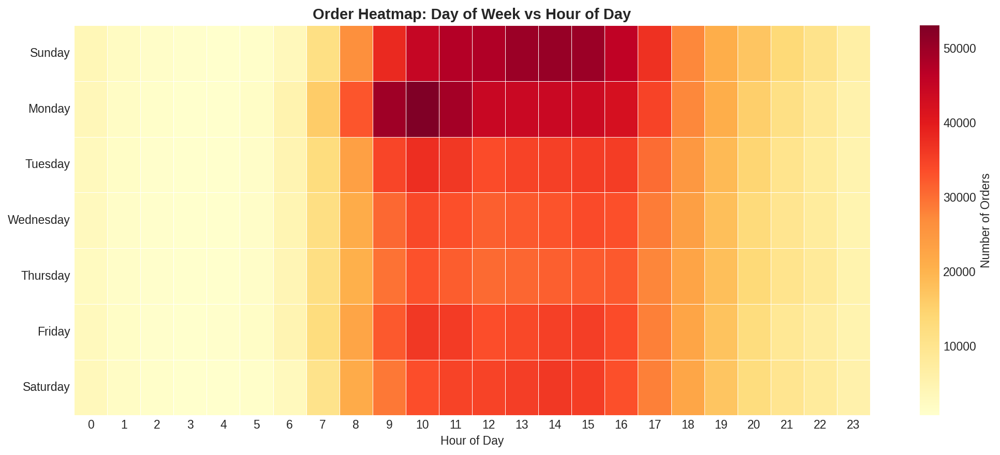
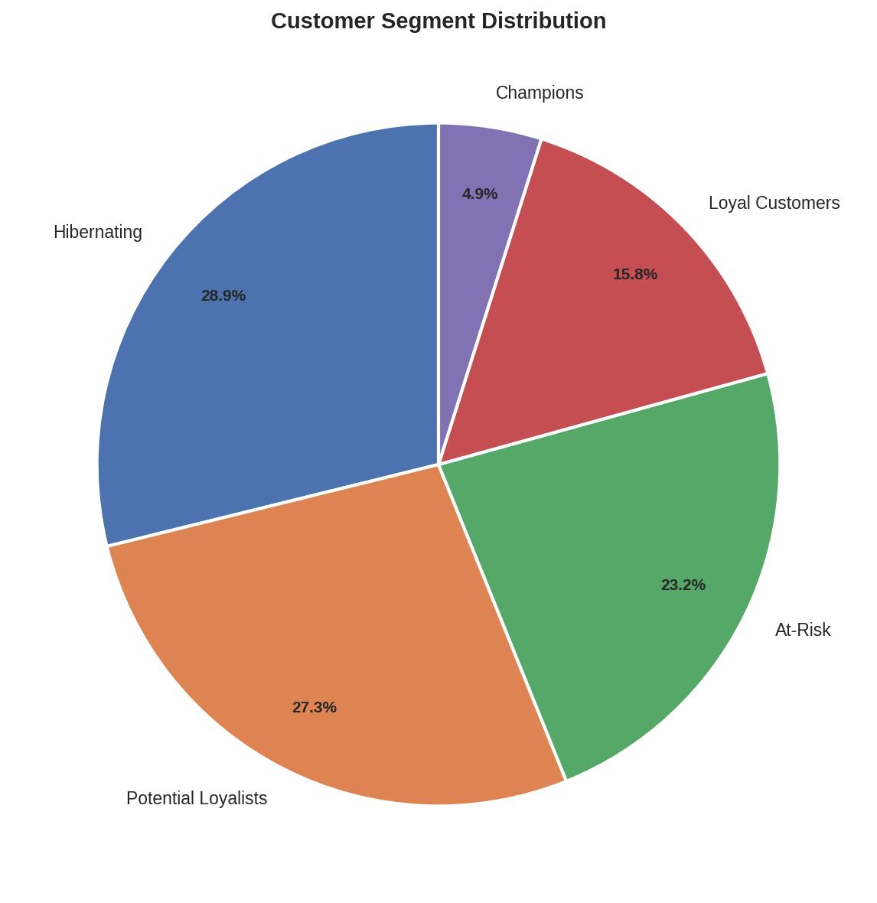
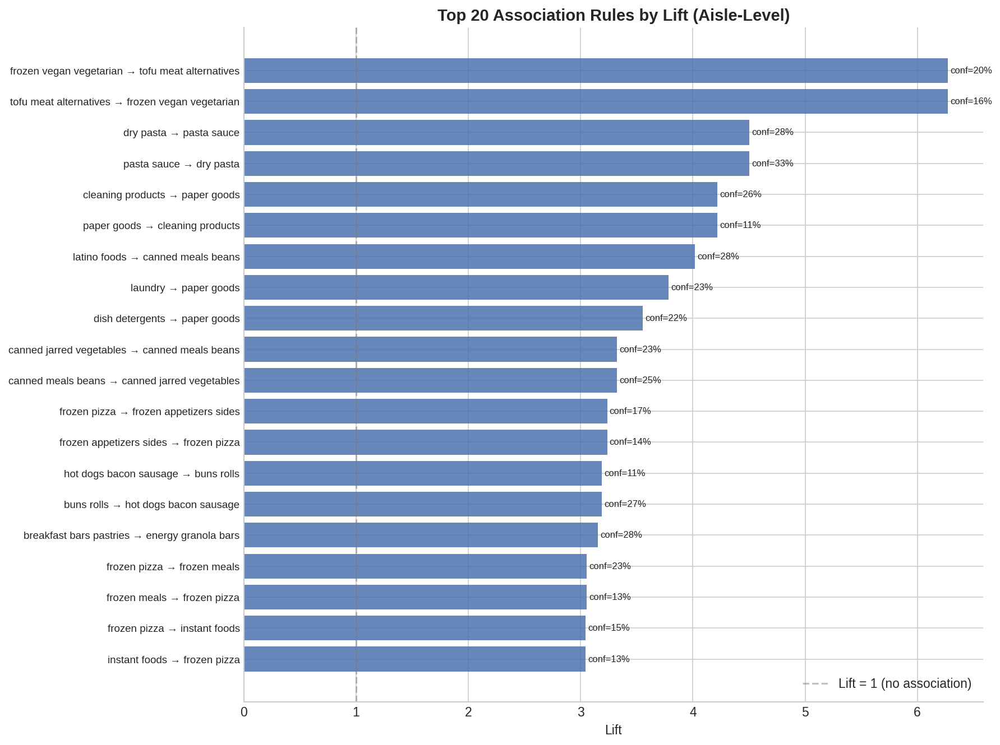

# BasketIQ | Market Basket Analysis

Analyzed 32.4M grocery transactions to mine association rules and segment 206,209 users into 5 RFM-based clusters. Visualized findings in an interactive HTML dashboard to drive targeted marketing and customer retention strategies.

**[Live Dashboard →](https://aman-720.github.io/BasketIQ/)**

---

## Results at a Glance

| Metric | Value |
|---|---|
| Transactions analyzed | 32,434,489 |
| Unique users | 206,209 |
| Products | 49,688 across 21 departments, 134 aisles |
| Association rules found | 2,016 (aisle-level) + 158 (product-level) |
| Customer segments | 5 (K-Means, silhouette = 0.271) |
| Avg reorder rate | 58.9% |
| Avg basket size | 10.1 items/order |

---

## Dashboard Preview


*Orders by day of week and hour — Sunday & Monday peak, 10 AM–3 PM window*


*5 RFM-based customer clusters — Champions to Hibernating*


*Top aisle-level association rules by lift (max lift: 6.27)*

---

## About the Data

This project uses the **Instacart Market Basket Analysis** dataset — publicly available on [Kaggle](https://www.kaggle.com/c/instacart-market-basket-analysis/data).

You have two options to get the data:

### Option A — Generate synthetic data (quickest, no account needed)

```bash
python generate_data.py
```

Runs in ~10 seconds. Produces ~2.7M realistic transaction rows matching the Instacart schema exactly. Product names are real; purchase patterns are statistically modelled.

### Option B — Download the real Instacart dataset from Kaggle

```bash
pip install kaggle
# Put your kaggle.json API key in ~/.kaggle/
kaggle competitions download -c instacart-market-basket-analysis
unzip instacart-market-basket-analysis.zip -d data/raw/
```

See [`data/raw/README.md`](data/raw/README.md) for full setup instructions.

---

## Project Structure

```
BasketIQ/
├── generate_data.py              # Synthetic data generator (run this first)
├── requirements.txt
├── .gitignore
│
├── src/
│   ├── config.py                 # Central config: paths, parameters, styling
│   ├── 01_eda.py                 # Exploratory Data Analysis (10 charts)
│   ├── 02_association_rules.py   # Apriori mining — aisle + product rules (4 charts)
│   ├── 03_rfm_clustering.py      # RFM scoring + K-Means clustering (6 charts)
│   └── 04_recommendations.py    # 3 recommendation methods (3 charts)
│
├── data/
│   ├── raw/                      # Source CSVs (gitignored — see data/raw/README.md)
│   └── processed/                # Analysis outputs (CSVs + JSONs)
│
├── visualizations/               # 23 publication-quality PNG charts
├── dashboard/
│   └── index.html                # Self-contained interactive dashboard
└── docs/
    └── index.html                # GitHub Pages deployment
```

---

## How to Run

```bash
# 1. Install dependencies
pip install -r requirements.txt

# 2. Get data (synthetic or real — see "About the Data" above)
python generate_data.py

# 3. Run the full analysis pipeline
cd src/
python 01_eda.py
python 02_association_rules.py
python 03_rfm_clustering.py
python 04_recommendations.py

# 4. Open the dashboard (no server needed)
open ../dashboard/index.html
```

---

## Analysis Modules

### 1. Exploratory Data Analysis

- Peak ordering: Sunday & Monday, with activity from 8 AM–5 PM
- Top product: Banana (472K orders), Bag of Organic Bananas (379K)
- Produce dominates at 29.2% of all items ordered
- 58.9% reorder rate; avg 11.1 days between orders

### 2. Association Rule Mining (Apriori)

- **Aisle-level** (2,016 rules): Strongest rule — Frozen Vegan/Vegetarian → Tofu/Meat Alternatives (lift: 6.27)
- **Product-level** (158 rules): Strongest rule — Organic Garlic → Organic Ginger Root (lift: 3.25)
- Co-occurrence heatmap of top 12 aisles
- Support vs confidence scatter plot

### 3. RFM Segmentation + K-Means Clustering

| Segment | Users | Avg Orders | Avg Items | Marketing Strategy |
|---|---|---|---|---|
| Champions | 10,044 (4.9%) | 64.8 | 826 | Loyalty rewards & early access |
| Loyal Customers | 32,655 (15.8%) | 32.5 | 347 | Upsell & referral programs |
| Potential Loyalists | 56,200 (27.3%) | 14.7 | 122 | Personalized frequency offers |
| At-Risk | 47,813 (23.2%) | 7.2 | 61 | Win-back campaigns |
| Hibernating | 59,497 (28.9%) | 5.6 | 51 | Re-engagement emails |

### 4. Product Recommendation Engine

Three complementary methods:
1. **Item-Item Collaborative Filtering** — cosine similarity on user-product purchase matrix (195K users × 150 products)
2. **Co-purchase Analysis** — top pair: Bag of Organic Bananas + Organic Hass Avocado (2,609 co-purchases)
3. **Reorder Probability** — per-user next-basket prediction based on purchase history

---

## Interactive Dashboard

**[View live →](https://aman-720.github.io/BasketIQ/)**
Or open `dashboard/index.html` locally in any browser — no server needed.

Four tabs: Overview · Association Rules · Customer Segments · Recommendations

Built with Chart.js 4.5 — line, bar, doughnut, radar, and scatter charts, KPI cards, and sortable data tables.

---

## Tech Stack

| Layer | Tools |
|---|---|
| Language | Python 3.10 |
| Data | pandas 2.3.3, NumPy 2.2.6 |
| Association Rules | mlxtend 0.23.4 (Apriori) |
| Clustering | scikit-learn 1.7.2 (K-Means, silhouette_score) |
| Recommendations | scikit-learn (cosine_similarity), scipy 1.15.3 |
| Visualization | matplotlib 3.10.8, seaborn 0.13.2 |
| Dashboard | Chart.js 4.5, HTML / CSS / JS |

---

## Key Business Insights

1. **58.9% reorder rate** — subscription or auto-reorder features would directly increase retention
2. **Sunday & Monday peak** — schedule promotions and delivery capacity around these windows
3. **20.7% of users are Champions or Loyal** — invest heavily in retention for this core
4. **52.1% are At-Risk or Hibernating** — targeted win-back campaigns have high ROI potential
5. **Organic produce anchors top co-purchase pairs** — use organic bananas + avocado as cross-sell bundle
6. **Dry Pasta → Pasta Sauce (lift 4.5)** — bundle these in weekly deal promotions
7. **Champions order 11.6x more often than Hibernating users** — significant upsell and retention opportunity

---

## Future Work

Several natural extensions could make this pipeline production-grade:

- **LLM-powered personalisation** — pipe each customer segment's profile into an LLM (e.g. Claude) to auto-generate personalised marketing email copy per segment, turning the clustering output directly into a campaign-ready asset
- **Real-time inference** — wrap the association rule engine and recommendation model in a FastAPI service so product recommendations can be served live at checkout
- **Temporal dynamics** — incorporate order timestamps to build time-decay RFM scores and detect seasonal purchase shifts (e.g. holiday basket patterns)
- **Deep learning recommendations** — replace item-item cosine similarity with a neural collaborative filtering model (e.g. two-tower architecture) for improved cold-start handling
- **A/B testing framework** — add experimentation scaffolding to measure uplift from segment-specific promotions against a holdout control group

---

## Author

**Aman Pandey** · [mailto.aman720@gmail.com](mailto:mailto.aman720@gmail.com) · [LinkedIn](https://www.linkedin.com/in/amanpandeyy) ·
